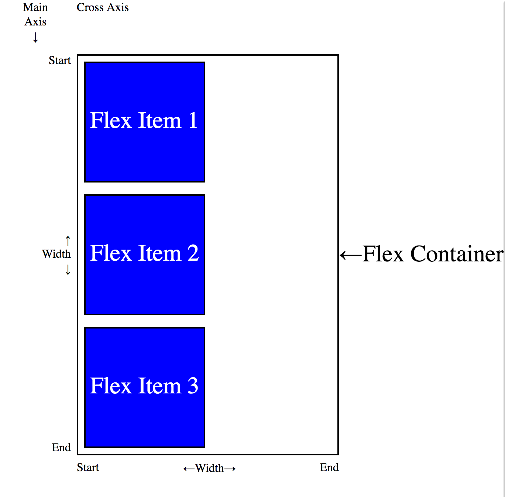
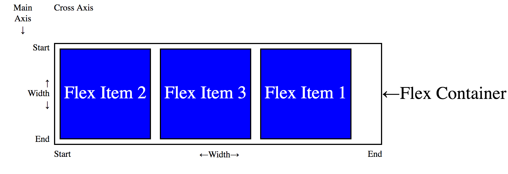
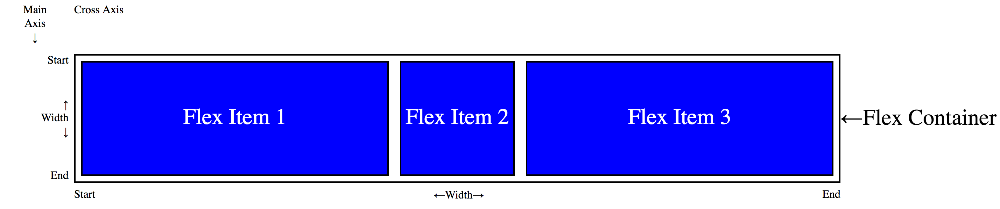
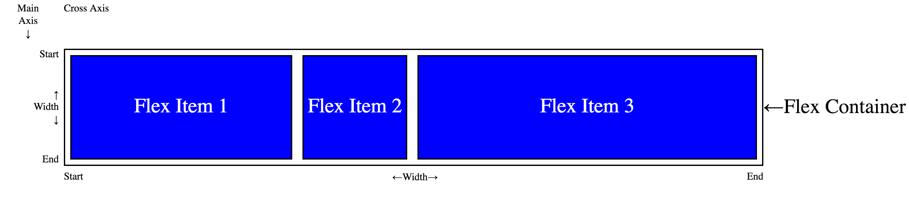

# Chapter 3: Flex Container

## Creating A Flex Container

## Flex Flow

```html
<div class="container">
  <div class="item">Flex Item 1</div>
  <div class="item">Flex Item 2</div>
  <div class="item">Flex Item 3</div> 
</div>
```

```css
.container {
  display: flex;
  border: 2px solid black;
  flex: 1;
}

.item {
  display: flex;
  justify-content: center;
  align-items: center;
  border: 2px solid black;
  height: 10rem;
  width: 10rem;
  margin: .5rem;
  color: white;
  background-color: blue;
}
```


```css {
  .item {
    flex-direction: column;
  }
}
```



## Display Order

```html
<div class="container">
  <div class="item" style="order: 1;">Flex Item 1</div>
  <div class="item">Flex Item 2</div>
  <div class="item">Flex Item 3</div> 
</div>
```


## Flexibility

### Flex Grow

```html
<div class="container">
  <div class="item">Flex Item 1</div>
  <div class="item">Flex Item 2</div>
  <div class="item" style="flex-grow: 1;">Flex Item 3</div>
</div>
```


```html
<div class="container">
  <div class="item" style="flex-grow: 1;">Flex Item 1</div>
  <div class="item">Flex Item 2</div>
  <div class="item" style="flex-grow: 1;">Flex Item 3</div>
</div>
```



```html
<div class="container">
  <div class="item" style="flex-grow: 1;">Flex Item 1</div>
  <div class="item">Flex Item 2</div>
  <div class="item" style="flex-grow: 2;">Flex Item 3</div>
</div>
```



### Flex Shrink

### Flex Basis

### Shorthand

## Alignment

### Justify Content

### Align Items

### Align Content